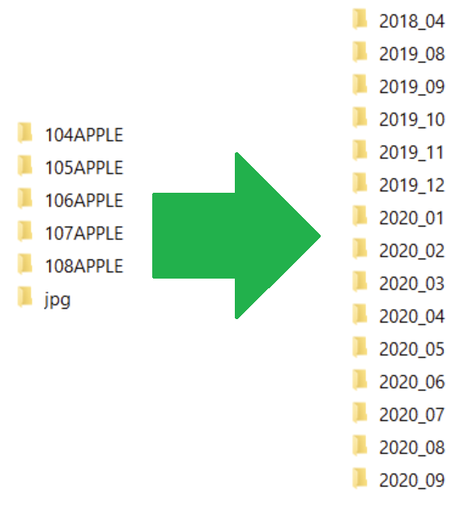

## About 

If you have mixed photo files, you can use `file-organizer` to sort out files.

## Requirements

This script is using `exifreader` package to get image metadata.

`pip install exifreader`

## Usage

`python organizer.py --input C:\Users\user\files --output C:\Users\user\organized`

  

<h1 align="center">
   
</h1>
